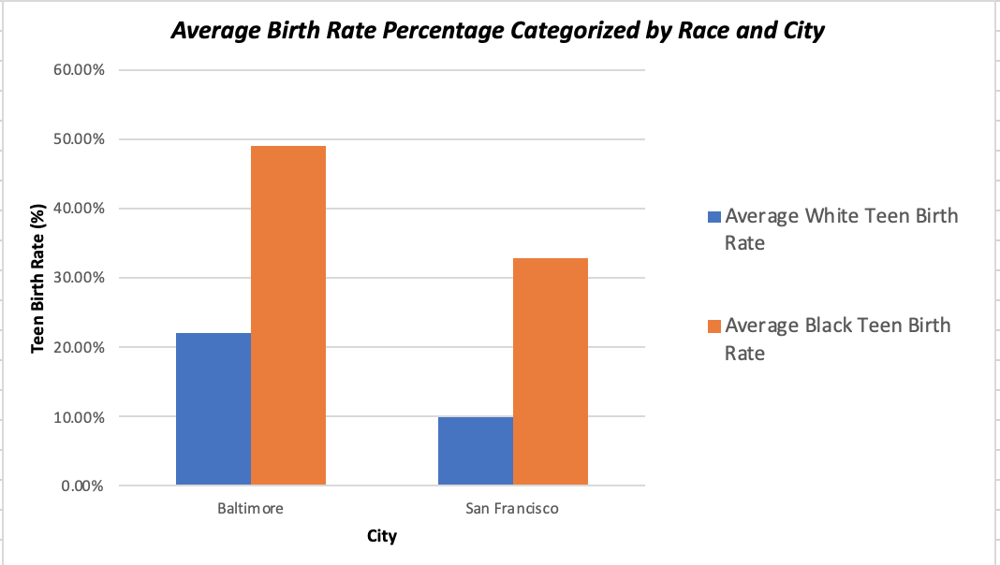

# Comparing Teenage Birth Rate in Baltimore, MD and San Francisco, CA with Opportunity Atlas Data
## Background Information 

Last summer, I worked with the Baltimore City Health Department (BCHD) for a federally-funded project to address health-related social needs of pregnant women. One day, as I sat across from the fourth pregnant teenager I had interviewed that week alone, I knew I had stumbled upon a public health crisis. According to data from the [Strategic Plan to Reduce Teen Births in Baltimore City](https://www.healthyteennetwork.org/wp-content/uploads/2014/10/StrategicPlanReduceTeenBirthsBaltimoreCity.pdf), average teen birth rates in Baltimore city are three times the national average and are disproportionately high in Black and Hispanic populations.

Recognizing the disparities in access to healthcare due to income level, I wanted to delve further into the trends of racial disparities in populations of the same income level. We will use open data from Opportunity Atlas to analyze the differences in teen birth rates as determined by race, looking only at low-income populations in Baltimore, MD and my hometown, San Francisco, CA. 

## Business Question

_How do health-related racial disparities contribute to teen birth rates of populations with low parent income in Baltimore, MD and San Francisco, CA?_ 

## Data Question - Open Data 

We will use open data from Opportunity Insights' [Opportunity Atlas](https://opportunityinsights.org/data/?geographic_level=0&topic=0&paper_id=1652#resource-listing), an online database of anonymous data following 20 million Americans from childhood to mid-30s with the goal of identifying areas of the United States with best and worst social mobility. We will compare Baltimore, MD and San Francisco, CA, using two datasets.
1. [Baltimore, MD](baltimore-data.xlsx): this dataset contains the teenage birth rates for White and Black populations with low-income parents categorized by neighborhood in Baltimore City. 
1. [San Francisco, CA](sf-data.xlsx): contains the same metrics as the first dataset, categorized by neighborhood in San Francisco. 

## Data Answer 

First, we compare trends for White and Black teen birth rates in both Baltimore and San Francisco. To accurately compare teen birth rates in both populations, we must try to eliminate differences due to geographical location and income level. Therefore, we selected neighborhoods in which data was collected for both White and Black populations with low income parents in [Baltimore](baltimore-graph.png) and [San Francisco](sf-graph.png), averaged the birth rates of all neighborhoods, and compared the average teen birth rates for both cities.

As the graph depicts, average White and Black teen birth rates are high for Baltimore than that of San Francisco. In both cities, the average White birth rate is more than twice the average Black birth rate. These results show that even when we compare within the same income level, racial and socio-ecological disparities contribute to the substantially higher teen birth rates in Black populations. As the [Teen Pregnancy Prevention Plan](https://health.baltimorecity.gov/node/170) implemented by BCHD suggests, potential contributors to higher teen birth rates (especially in minority groups) include: 
1. lack of access to sexual education
1. lack of access to clinical services 
1. social support to make informed decisions surrounding sexual health

The data analysis corroborates the correlation of teen birth with health disparities related to race. To expand into other socio-ecological factors that contribute to sexual  

